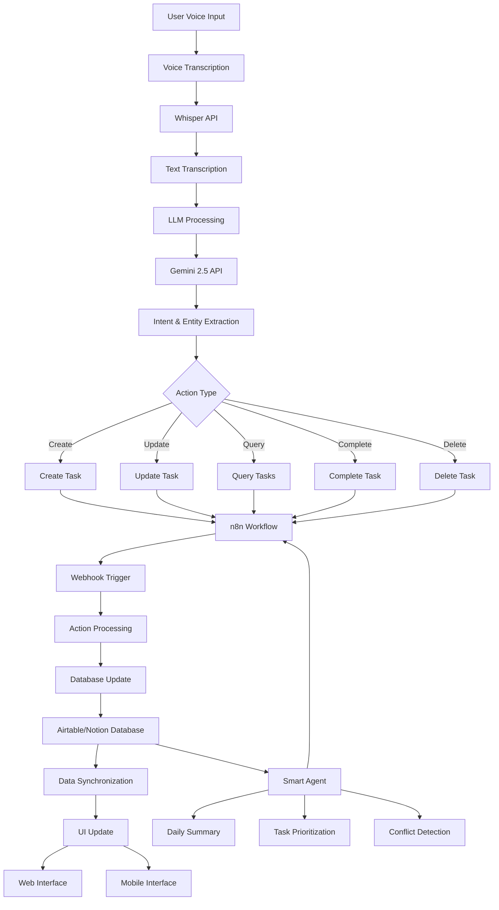

# System Architecture Diagram
## Version: 1.0
## Date: March 28, 2025

```mermaid
graph TD
    A[User Voice Input] --> B[Voice Transcription]
    B --> C[Whisper API]
    C --> D[Text Transcription]
    D --> E[LLM Processing]
    E --> F[Gemini 2.5 API]
    F --> G[Intent & Entity Extraction]
    
    G --> H{Action Type}
    H -->|Create| I[Create Task]
    H -->|Update| J[Update Task]
    H -->|Query| K[Query Tasks]
    H -->|Complete| L[Complete Task]
    H -->|Delete| M[Delete Task]
    
    I --> N[n8n Workflow]
    J --> N
    K --> N
    L --> N
    M --> N
    
    N --> O[Webhook Trigger]
    O --> P[Action Processing]
    P --> Q[Database Update]
    
    Q --> R[Airtable/Notion Database]
    R --> S[Data Synchronization]
    S --> T[UI Update]
    
    T --> U[Web Interface]
    T --> V[Mobile Interface]
    
    W[Smart Agent] --> X[Daily Summary]
    W --> Y[Task Prioritization]
    W --> Z[Conflict Detection]
    
    R --> W
    W --> N
```
